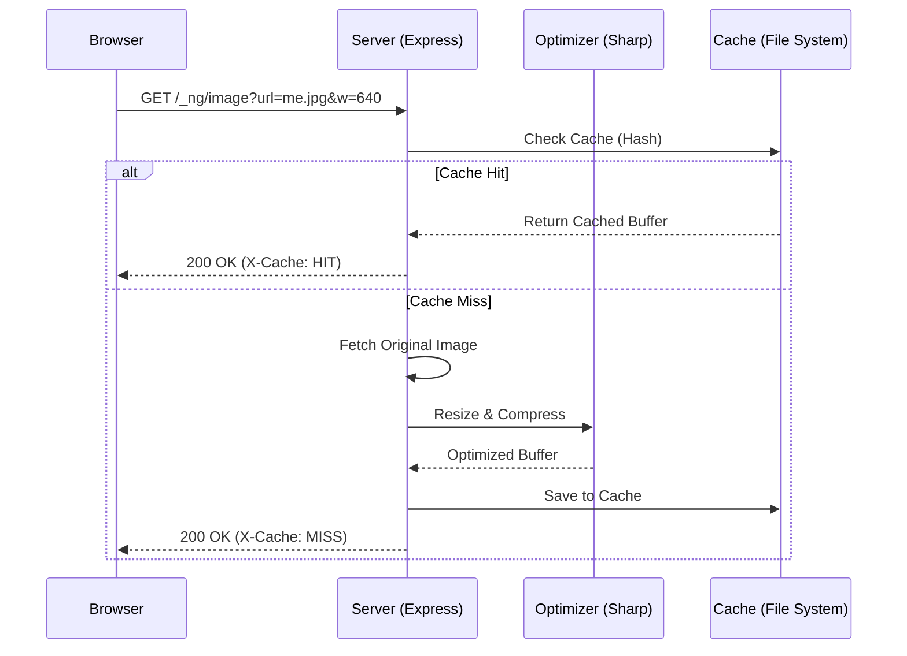

# 🖼️ NgImageOptimizer

**NgImageOptimizer** is a high-performance image optimization library for Angular SSR applications. It bridges the gap between Angular's `NgOptimizedImage` and server-side processing using [sharp](https://sharp.pixelplumbing.com/), providing a Next.js-like image optimization experience.

---

## 🚦 Quick Start

The fastest way to get started is using our automated schematic:

```bash
ng add ng-image-optimizer
```

## ✨ Features

- **🚀 Performance**: Automatic resizing, format conversion (WebP/AVIF), and quality adjustment.
- **⚡ Seamless Integration**: Works directly with Angular's built-in `NgOptimizedImage` directive.
- **💾 Advanced Caching**: Persistent file-based caching with LRU (Least Recently Used) logic to minimize server load.
- **🛡️ Secure by Default**: Built-in Content Security Policy (CSP) headers and SVG protection.
- **🛠️ Automated Setup**: Includes an `ng add` schematic for zero-config integration.
- **🌍 Remote Image Support**: Securely fetch and optimize images from external domains via allowlists.

---

This command will:

1. Install necessary dependencies (`sharp`, `lru-cache`).
2. Register the image loader in your `app.config.ts`.
3. Configure the optimization middleware in your Express `server.ts`.

---

## 🏗️ Architecture

NgImageOptimizer consists of two main parts:

### 1. Client-Side Loader

A custom `IMAGE_LOADER` that transforms Angular's image requests into optimization queries (e.g., `/_ng/image?url=...&w=1080&q=75`).

### 2. Server-Side Middleware

An Express middleware that intercept requests, fetches the source image (local or remote), optimizes it using `sharp`, and caches the result for future hits.



<!-- --- -->

<!-- ## 📖 Documentation & Examples -->

<!-- For detailed configuration, manual setup, and API references, please check the [Library Documentation](file:///c:/Users/LOQ/Desktop/Projects/ng-image-optimizer/projects/ng-image-optimizer/README.md). -->

---

## 🛠️ Development

### Prerequisites

- Node.js (v18+)
- Angular CLI
- Angular SSR

<!-- ### Commands

```bash
# Build the library
ng build ng-image-optimizer

# Run the demo application
ng serve ng-image-optimizer-demo

# Run tests
ng test ng-image-optimizer
```

--- -->

## 📄 License

MIT © [hasan-kakeh](https://github.com/hasan-kakeh)
