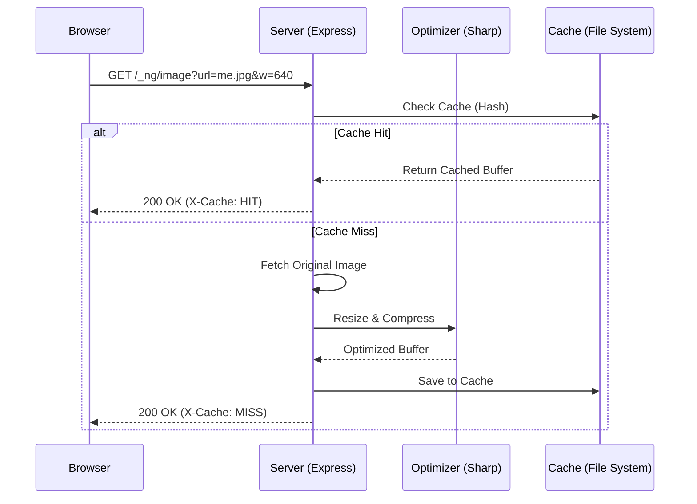

# 🖼️ NgImageOptimizer

**NgImageOptimizer** is a high-performance image optimization library for Angular SSR applications. It bridges the gap between Angular's `NgOptimizedImage` and server-side processing using [sharp](https://sharp.pixelplumbing.com/), providing a Next.js-like image optimization experience.

[**Documentation**](https://hasan-kakeh.github.io/ng-image-optimizer/)

---

### Prerequisites

- Node.js (v18+)
- Angular CLI
- Angular SSR

---

## 🚦 Quick Start

The fastest way to get started is using our automated schematic:

```bash
ng add ng-image-optimizer
```

---

This command will:

1. Install necessary dependencies (`sharp`).
2. Register the image loader in your `app.config.ts`.
3. Configure the optimization middleware in your Express `server.ts`.

---

### 🛠️ Manual Setup

If you prefer to configure things manually, follow these steps:

Install the library and its peer dependencies:

```bash
npm install ng-image-optimizer sharp
```

#### Client-Side Configuration

Register the image loader in your `app.config.ts`:

```typescript
import { provideImageOptimizerLoader } from 'ng-image-optimizer';

export const appConfig: ApplicationConfig = {
  providers: [provideImageOptimizerLoader()],
};
```

#### Server-Side Configuration

Add the middleware to your `server.ts` before other routes:

```typescript
import { imageOptimizerHandler } from 'ng-image-optimizer/server';

// ... early in your express app setup
const browserDistFolder = resolve(serverDistFolder, '../browser');

server.get('/_ng/image', imageOptimizerHandler(browserDistFolder));
```

---

## ✨ Features

- **🚀 Performance**: Automatic resizing, format conversion (WebP/AVIF), and quality adjustment.
- **⚡ Seamless Integration**: Works directly with Angular's built-in `NgOptimizedImage` directive.
- **💾 Advanced Caching**: Persistent file-based caching with LRU (Least Recently Used) logic to minimize server load.
- **🛡️ Secure by Default**: Built-in Content Security Policy (CSP) headers and SVG protection.
- **🛠️ Automated Setup**: Includes an `ng add` schematic for zero-config integration.
- **🌍 Remote Image Support**: Securely fetch and optimize images from external domains via allowlists.

## 🏗️ Architecture

NgImageOptimizer consists of two main parts:

### 1. Client-Side Loader

A custom `IMAGE_LOADER` that transforms Angular's image requests into optimization queries (e.g., `/_ng/image?url=...&w=1080&q=75`).

### 2. Server-Side Middleware

An Express middleware that intercept requests, fetches the source image (local or remote), optimizes it using `sharp`, and caches the result for future hits.



---

## 🛞 Usage

Use standard Angular `NgOptimizedImage` in your templates. The library will automatically handle the resolution and optimization.

```html

```

---

## ⚙️ Configuration

### Client Provider (`ImageOptimizerLoaderOptions`)

When registering `provideImageOptimizerLoader`, you can pass the following options:

| Property         | Type     | Default      | Description                                                       |
| :--------------- | :------- | :----------- | :---------------------------------------------------------------- |
| `routePrefix`    | `string` | `/_ng/image` | The path where the image optimizer middleware is mounted.         |
| `defaultWidth`   | `number` | `1080`       | The default width used if `NgOptimizedImage` doesn't provide one. |
| `defaultQuality` | `number` | `90`         | The default image quality (1-100).                                |

### Server Middleware (`ImageConfig`)

When initializing `imageOptimizerHandler`, you can pass an optional configuration object:

| Property                 | Type                     | Default                | Description                                  |
| :----------------------- | :----------------------- | :--------------------- | :------------------------------------------- |
| `deviceSizes`            | `number[]`               | `[640, 750, 828, ...]` | Allowed widths for device breakpoints.       |
| `imageSizes`             | `number[]`               | `[16, 32, 48, ...]`    | Allowed widths for smaller UI elements.      |
| `remotePatterns`         | `RemotePattern[]`        | `[]`                   | List of allowed external domains.            |
| `localPatterns`          | `LocalPattern[]`         | `[]`                   | List of allowed local path patterns.         |
| `minimumCacheTTL`        | `number`                 | `14400` (4h)           | Minimum time (seconds) to cache an image.    |
| `formats`                | `string[]`               | `['image/webp']`       | Favored output formats (supports webp/avif). |
| `dangerouslyAllowSVG`    | `boolean`                | `false`                | Whether to allow processing SVG images.      |
| `contentSecurityPolicy`  | `string`                 | `...`                  | CSP headers for the served images.           |
| `contentDispositionType` | `'inline'\|'attachment'` | `'inline'`             | How the browser should handle the image.     |
| `maxCacheSize`           | `number`                 | `52428800` (50MB)      | Maximum size of the internal LRU cache.      |

---

## 📄 License

ng-image-optimizer is an open source package released under the MIT license. See the LICENSE file for more information.
